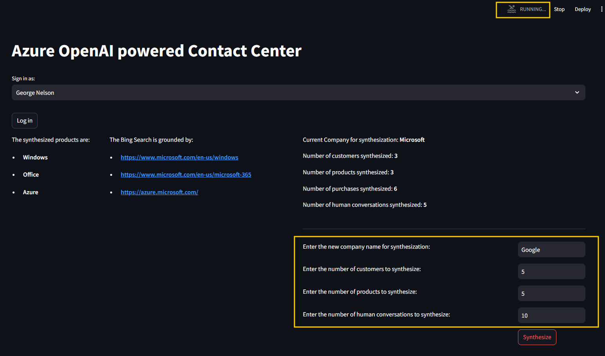

# AOAI_ContactCenterDemo
This is a demo project for the AOAI Contact Center. It is a simple web application that demonstrate how Generative AI can revolutionize contact center operations. The application is built using the Azure OpenAI Service, Bing Custom Search, Azure CosmosDB, Power BI and Streamlit (as current web app frontend).

## Demo Video
[](https://youtu.be/EhXrOZg2NCE?si=jG-SlRPvSY4AWAG6)

## Architecture


## Prerequisites
- Azure Subscription
- Azure OpenAI Service
- Bing Search API/ Bing Custom Search API
- Azure CosmosDB
- Power BI Desktop and Power BI Service
- For frontend: 
    - ON Azure: Azure Container Registry, Web App
    - Locally: Docker/Streamlit

## Deployment (ToDos)
- Terraform/Bicep scripts for deploying the Azure resources
- CI/CD pipeline using GitHub Actions for deploying the frontend to Azure Web App

## Test locally using Docker image
1. ensure Docker is installed and Docker Desktop is running
2. run the following command in the root directory of the project
```docker build -t <give a name to tag your local image> -f docker/frontend.Dockerfile .```
3. run the following command to start the container
```docker run -p 80:80 <name of the image>```
4. open the browser and navigate to http://localhost:80

## Test locally using Streamlit
1. create a virtual environment
2. install the required packages
```pip install -r requirements.txt```
3. run the following command in the root directory of the project
```streamlit run .\frontend\streamlit_app.py```

## Synthesize data using Azure OpenAI API
in the frontend "log in" page, at the lower right corner, there is a button "Synthesize". 

Provide a random company name and the number of customers, products, previous purchases records and human-agent conversations to synthesize, then click on the button. When the "running" state of the upper-right corner is finished, refresh the page to have a complete set of backend data synthesized for you, ready to play with.