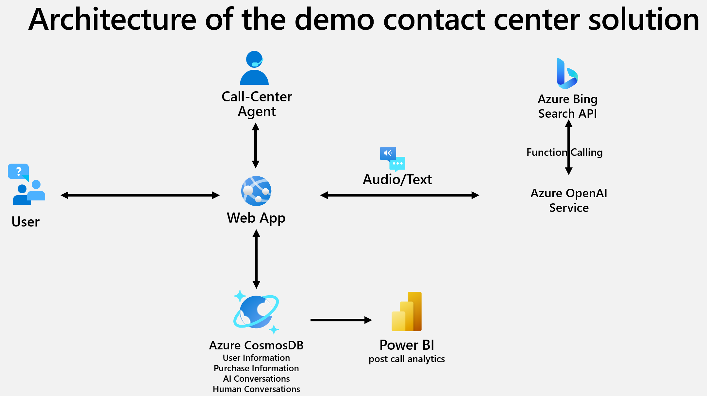

# AOAI_ContactCenterDemo
This is a demo project for the AOAI Contact Center. It is a simple web application that demonstrate how Generative AI can revolutionize contact center operations. The application is built using the Azure OpenAI Service, Bing Custom Search, Azure CosmosDB, Power BI and Streamlit (as current web app frontend).

## Demo Video
[](https://youtu.be/EhXrOZg2NCE?si=jG-SlRPvSY4AWAG6)

## Architecture


## Prerequisites
- Azure Subscription
- Azure OpenAI Service
- Bing Custom Search
- Azure CosmosDB
- Power BI
- For frontend: 
    - ON Azure: Azure Container Registry, Web App
    - Locally: Docker/Streamlit

## Deployment (ToDos)
- Terraform/Bicep scripts for deploying the Azure resources
- Dockerize the Streamlit application
- post deployment steps
  - streamline Bing Custom Search deployment: provide a list of search URIs of any company's website
  - fill the CosmosDB container "human conversations" with AI synthetic data
- upload the Power BI report template

## Test locally using Docker image
1. ensure Docker is installed and Docker Desktop is running
2. run the following command in the root directory of the project
```docker build -t <give a name to tag your local image> -f docker/frontend.Dockerfile .```
3. open the browser and navigate to http://localhost:80

## Test locally using Streamlit
1. create a virtual environment
2. install the required packages
```pip install -r requirements.txt```
3. run the following command in the root directory of the project
```streamlit run .\frontend\streamlit_app.py```
